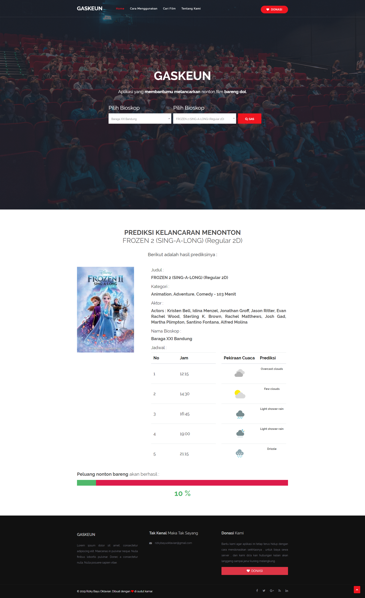
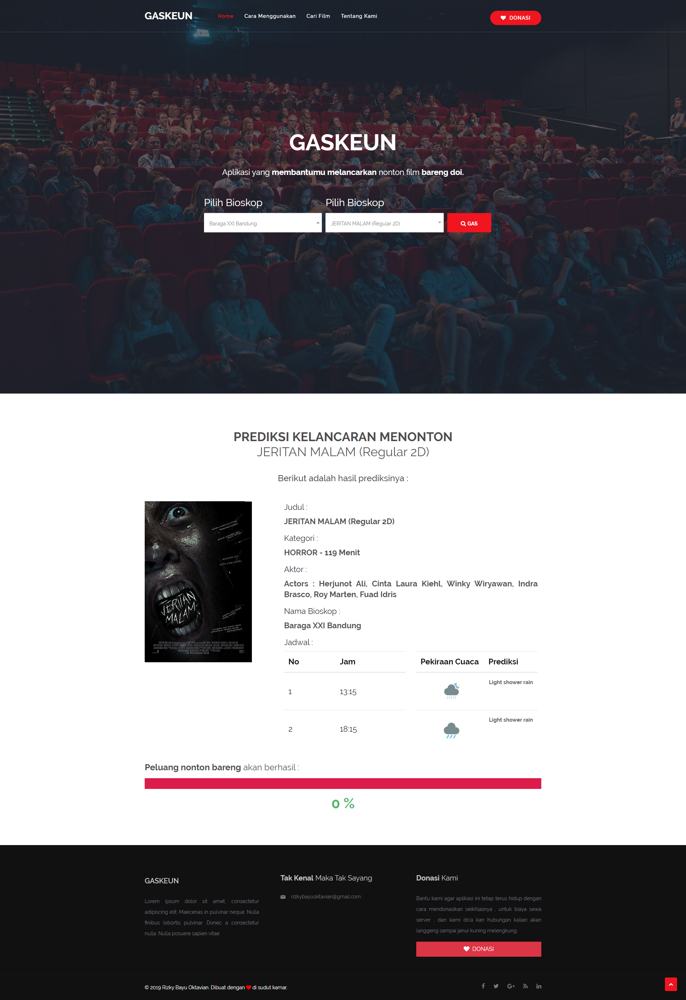
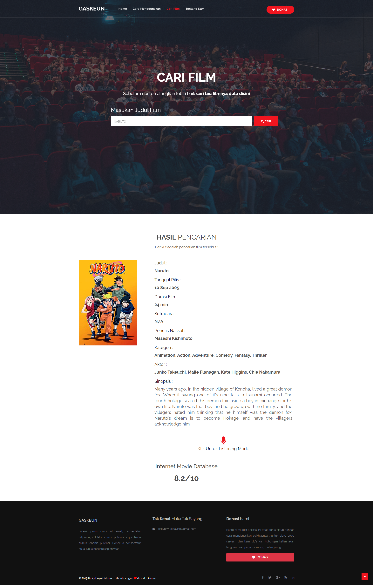
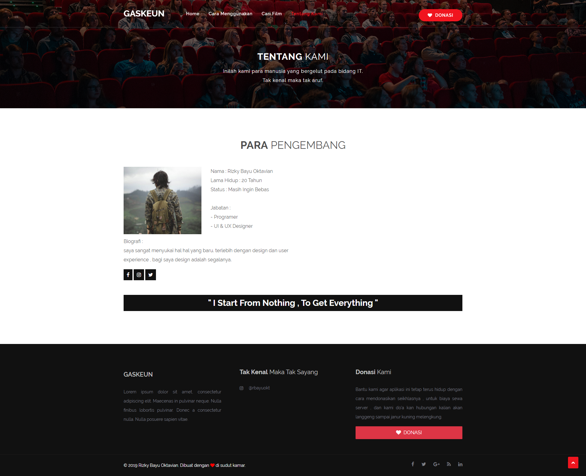

# Gaskeun-Web

Gaskeun adalah sebuah aplikasi berbasis website yang saya buat untuk memenuhi tugas besar mata kuliah pemrograman website di kampus.
gaskeun dibuat untuk memprediksi sebarapa besar kemungkinan kita untuk menonton sebuah film yang ada di bioskop di daerah Bandung, setelah itu nantinya aplikasi ini akan memunculkan jam film tersebut beserta dengan prediksi cuacanya, dan jika cuaca pada jam tersebut cerah maka kemungkinan besar untuk menonton film tersebut bisa bertambah, dan jika hujan maka kemungkinannya sangat kecil.

# Cara Menggunakan
1. User memilih bioskop mana yang akan ia tuju.
2. User memilih film.
3. User menekan tombol " GAS ".
4. Sistem akan memprediksi berdasarkan data dari API.
5. Sistem akan mengeluarkan output berupa informasi film beserta cuacanya.
6. User bisa melihat seberapa besar kemungkinan bisa menonton lewat prediksi dalam bentuk persen ( % ).

# Komponen yang digunakan 
- [x] Bootstrap 
- [x] PHP OOP
- [x] API Cuaca, API FILM, API JADWAL BIOSKOP

> kenapa gak pake framewrok php ? karena dosen saya tidak memperbolehkannya sebagai tantangannya

# Screenshoot

**Halaman Utama : **   

*jika ada cuaca yang cerah* 
  

*jika tidak ada cuaca yang cerah* 
  

**Mencari referensi film : **   
  

**About: **   
  

made with :heart: in Cimahi by @rbayuokt
